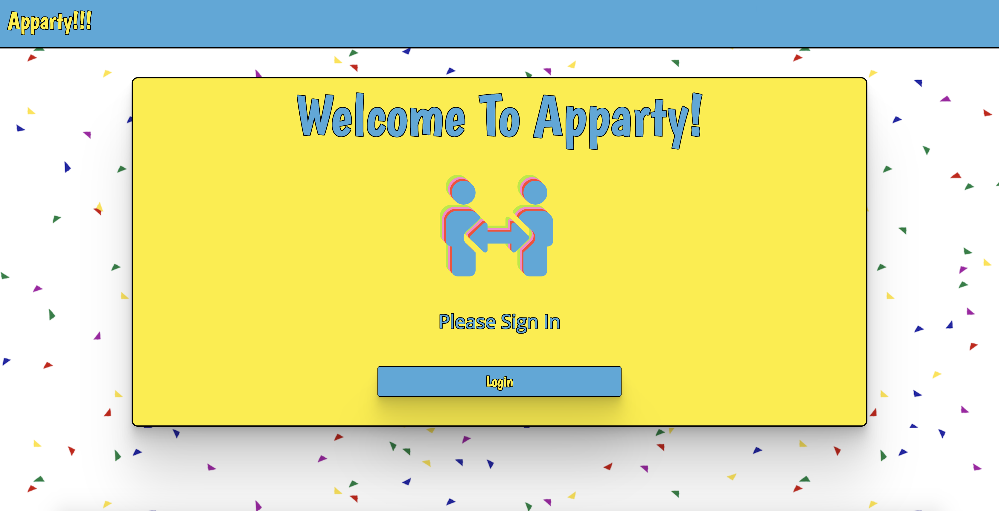
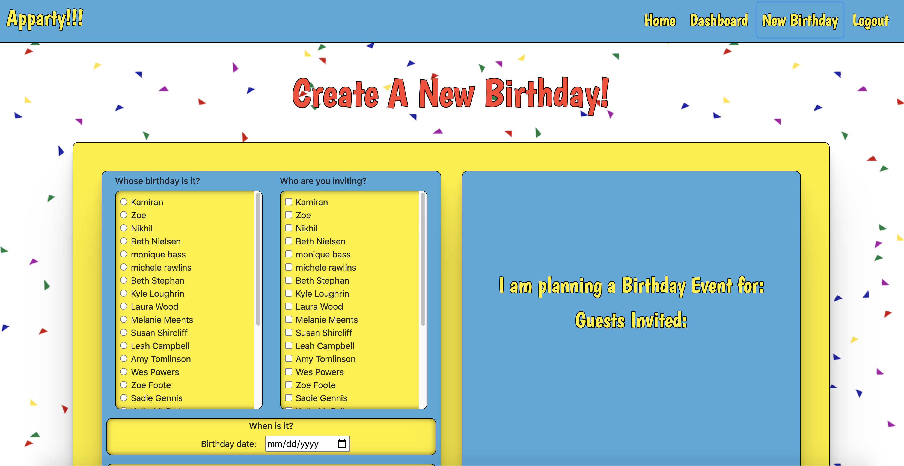
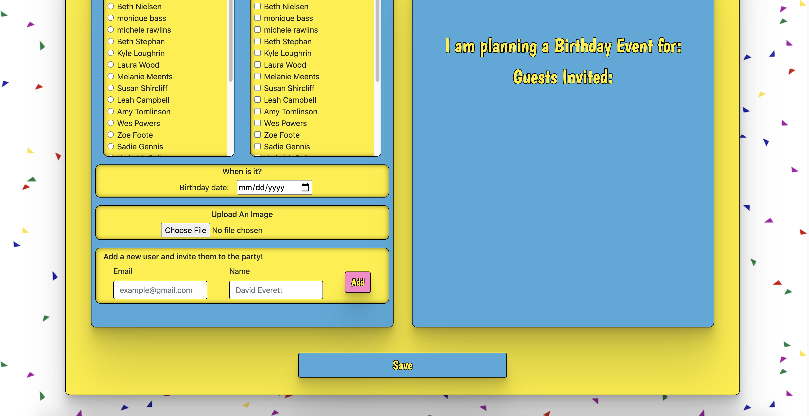
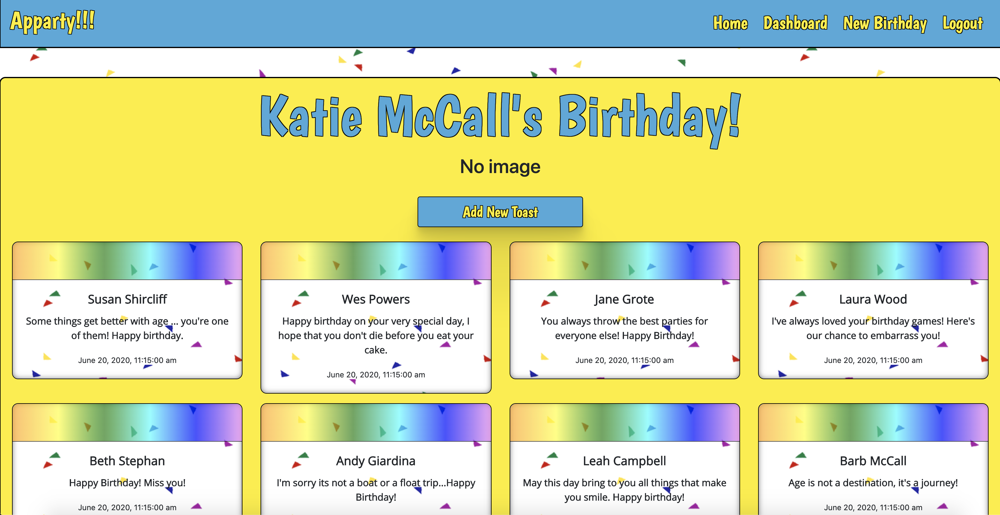
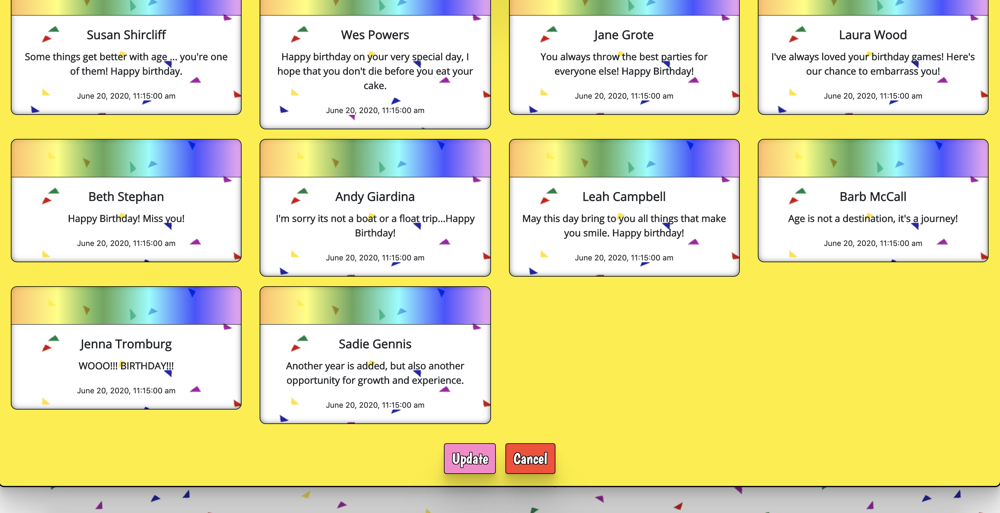
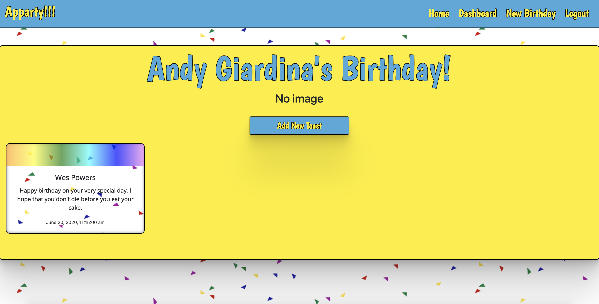
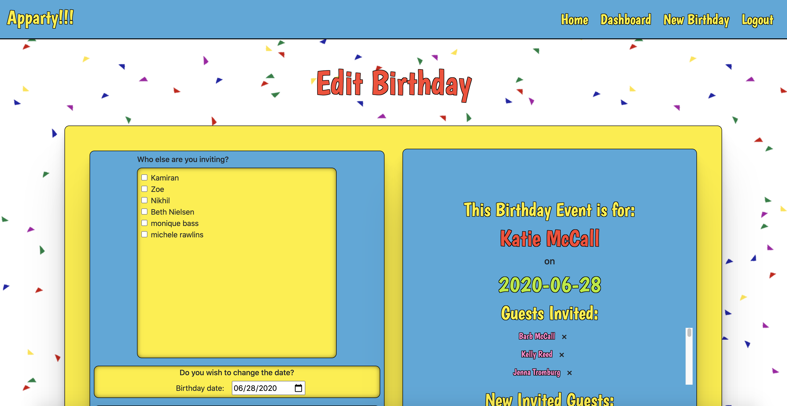
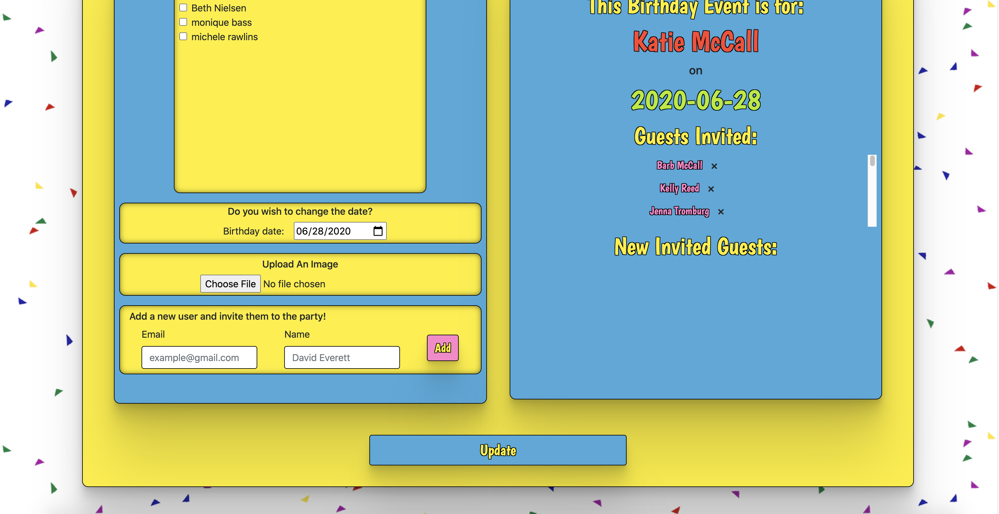
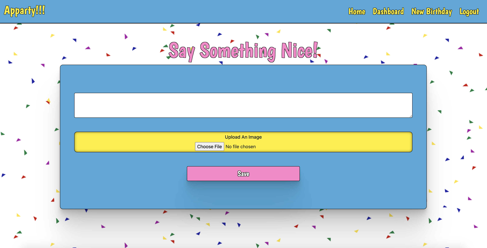

# Apparty: A Socially Distant Birthday App
## Live Version: 
Click [HERE](https://socially-distant-birthday.firebaseapp.com/home) to check out the deployed version.
## Description:
Apparty is a socially distant birthday tracking and celebration app.  It allows users to log on, create a birthday event for a friend, invite and notify other friends of said event, and allow those friends to log on and leave toasts and upload images for the guest of honor.  The guest of honor will then be notified of the event on the date of their birthday and then be able to log on and see what their friends have to say.
## Features:
* Full CRUD on birthday events if the user is the creator of said event.
* Full CRUD on any toast left by the user.
* Read-only on birthday events if the user is the birthday's guest of honor.
* Email notifications for invited users and the birthday guest of honor.
* Image upload so friends can share memorable pictures.
## Technologies Used:
* React
* React Router DOM
* Bootstrap 4
* reactstrap
* Moment.js
* Axios
* Firebase
    * Authentication via Google
    * Realtime Database
* Node.js email notification API using Nodemail and deployed to Heroku.
* Cloudinary for image uploading
* Webpack
* JavaScript
* HTML5
* CSS3/Sass
## Screenshots:
### Authentication Page

### Home/Landing Page

### Birthday Dashboard

### Create New Birthday Page
#### Top View

#### Bottom View

### Single Birthday View
#### User Created Birthay: Top View

#### User Created Birthday: Bottom View

#### User Invited Birthday

### Edit Birthday Page
#### Top View

#### Bottom View

### New Toast Page

### Edit Toast Page

## How To Run:
1. Clone down this repository to a local directory of your choosing.
2. `cd` into the repository and run `npm install` in your terminal.
3. Create a new Firebase project [HERE](https://console.firebase.google.com/).
4. At `src/helpers`, create a `apiKeys.json` file.  Within this file, insert the Firebase keys that were generated at the creation of your new Firebase project.  Please reference `apiKeys.example.json` to structure this file correctly.  Double check that `apiKeys.json` is included in the `.gitignore` file.
5. In your terminal, run `npm start`.  Your browser should automatically open to `localhost:3000` and the app should be up and running.  If this is not the case, run `hs -p 3000` and then navigate to [https://localhost:3000](https://localhost:3000).
